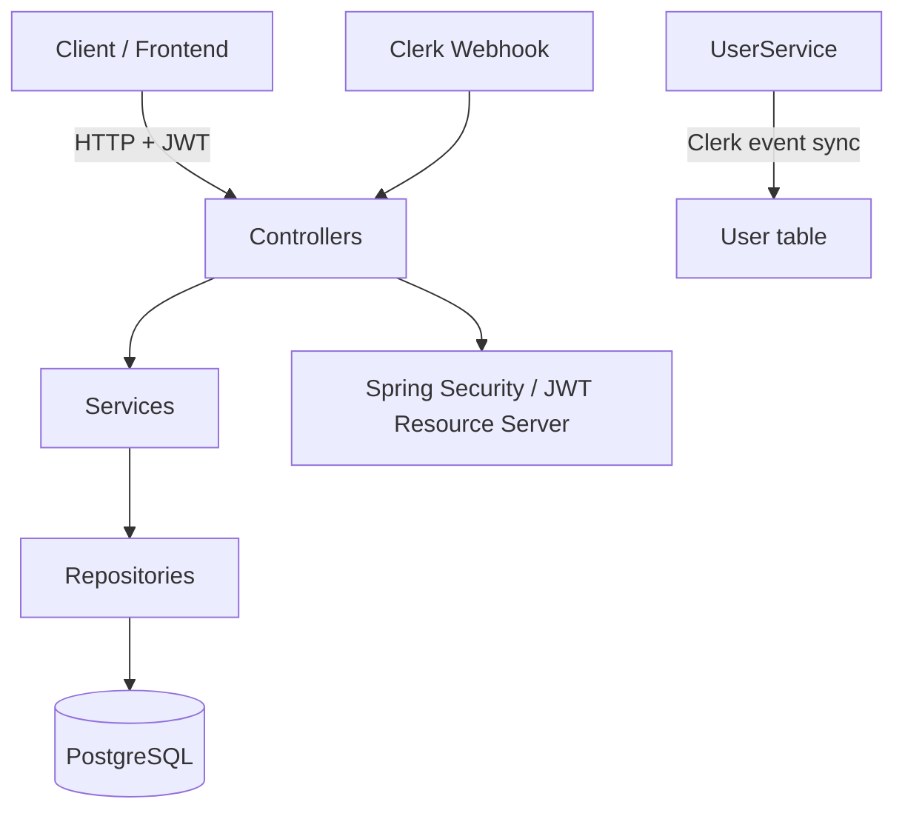
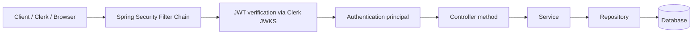
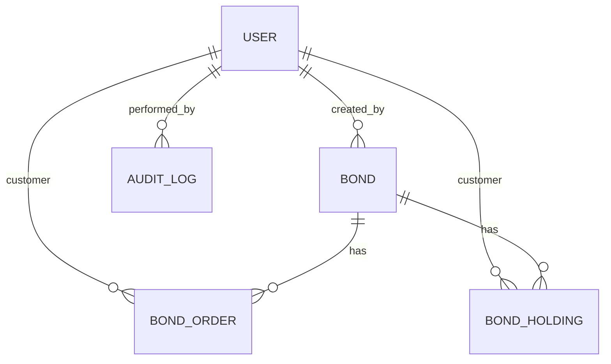
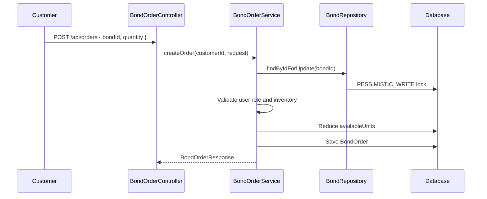

# Bond Platform Backend — Technical Documentation

Documentation generated from repository inspection.

## 1. Executive Summary

This repository is a Spring Boot backend for a bond platform with a narrow but concrete implementation footprint. Based on the code currently present, the system supports:

- Clerk-based user sync via webhook events
- User lifecycle tracking (active, suspended, deleted)
- Admin bond creation, listing, update, activation, suspension, and cancellation
- Customer bond purchase order creation with reserved inventory logic
- Customer order and holding lookup endpoints
- Security with JWT validation against a Clerk JWKS endpoint
- PostgreSQL persistence via JPA/Hibernate
- Global exception handling for common API errors

The implementation is not a full payment, settlement, or portfolio-processing system. There is no dedicated payment module, no payment provider integration, no scheduled jobs, and no migration scripts. Several flows are partially implemented or rely on assumptions that are not fully wired by the repository code.

## 2. System Overview

The application is organized as a conventional layered Spring Boot project with modules under `com.click4bonds.app.Modules`. The actual implementation focuses on bond catalog management and basic order/holding retrieval for customers, with Clerk acting as the external identity provider.

At the code level, the system currently contains:

- Auth and webhook integration with Clerk
- User model and admin/user management service
- Bond model, repository, DTOs, and admin controller
- Order model, service, and controller for customer purchase requests
- Holding model and controller/service for reading holdings
- Common exception handling
- PostgreSQL-backed JPA persistence

There is no evidence of a complete payment processing pipeline, settlement engine, coupon processing, or maturity handling.

## 3. Technology Stack

| Area | Technology | Evidence in repository |
|---|---|---|
| Language | Java 21 | `pom.xml` property `java.version` = `21` |
| Framework | Spring Boot 4.1.0 | Parent in `pom.xml` |
| Web | Spring Web MVC | `spring-boot-starter-webmvc` |
| Persistence | Spring Data JPA + Hibernate | `spring-boot-starter-data-jpa` |
| Security | Spring Security + OAuth2 Resource Server | `spring-boot-starter-security`, `spring-boot-starter-oauth2-resource-server` |
| Database | PostgreSQL | `org.postgresql:postgresql` and JDBC URL in `application.yaml` |
| Validation | Jakarta Validation | `spring-boot-starter-validation` |
| Identity integration | Clerk JWKS + Svix webhooks | `clerk.*` config and `com.svix:svix` dependency |
| API docs/monitoring | Spring Boot Actuator | `spring-boot-starter-actuator` |
| Build tool | Maven Wrapper | `mvnw`, `mvnw.cmd`, `pom.xml` |
| Code generation aid | Lombok | `org.projectlombok:lombok` |

## 4. Project Architecture

### 4.1 Architectural style

The project uses a layered Spring architecture with controller, service, repository, and model/DTO layers.



### 4.2 Layering discovered in code

- Controller layer:
  - Webhook controller
  - Admin bond controller
  - Admin customer controller
  - Order controller
  - Holding controller
- Service layer:
  - `WebhookService`
  - `UserService`
  - `AdminUserService`
  - `BondService`
  - `BondOrderService`
  - `BondHoldingService`
- Repository layer:
  - `UserRepository`
  - `BondRepository`
  - `BondOrderRepository` (in the Holding repository package)
  - `BondHoldingRepository`
- Domain model layer:
  - `User`
  - `Bond`
  - `BondOrder`
  - `BondHolding`
  - `AuditLog`
- DTO layer:
  - Bond request/response DTOs
  - Order DTOs
  - Clerk webhook DTO
  - API error DTO
- Common infrastructure:
  - Security configuration
  - CORS configuration
  - Global exception handling

### 4.3 Notable architecture gaps

The current codebase presents some partial or inconsistent patterns:

- Admin role enforcement is declared with `@PreAuthorize`, but no method-security configuration is enabled in `SecurityConfig`.
- `AdminBondController` resolves the user by calling `UUID.fromString(authentication.getName())`, which is a manual assumption and not backed by a custom JWT claim conversion.
- `BondOrderService` decrements bond inventory and creates an order, but does not create a holding, process payment, or finalize the order.
- `BondHolding` data model exists but is not created in the order flow.
- `AuditLog` exists as an entity but no controller/service writes to it in the repository inspected.

## 5. Project Structure

```text
src/
├── main/
│   ├── java/
│   │   └── com/click4bonds/app/
│   │       ├── AppApplication.java
│   │       ├── Config/
│   │       │   ├── CorsConfig.java
│   │       │   └── SecurityConfig.java
│   │       ├── Controller/
│   │       │   └── WebhookController.java
│   │       ├── Dto/
│   │       │   └── ClerkWebhookRequest.java
│   │       ├── Modules/
│   │       │   ├── Admin/
│   │       │   │   ├── Controller/
│   │       │   │   │   └── AdminCustomerController.java
│   │       │   │   ├── Model/
│   │       │   │   │   └── AuditLog.java
│   │       │   │   └── Service/
│   │       │   │       └── AdminUserService.java
│   │       │   ├── Bond/
│   │       │   │   ├── Controller/
│   │       │   │   │   └── AdminBondController.java
│   │       │   │   ├── Dto/
│   │       │   │   │   ├── BondResponse.java
│   │       │   │   │   ├── CreateBondRequest.java
│   │       │   │   │   └── UpdateBondRequest.java
│   │       │   │   ├── Enums/
│   │       │   │   │   ├── BondOrderStatus.java
│   │       │   │   │   ├── BondStatus.java
│   │       │   │   │   └── CouponFrequency.java
│   │       │   │   ├── Models/
│   │       │   │   │   └── Bond.java
│   │       │   │   ├── Repository/
│   │       │   │   │   └── BondRepository.java
│   │       │   │   └── Service/
│   │       │   │       └── BondService.java
│   │       │   ├── Common/
│   │       │   │   ├── Dto/
│   │       │   │   │   └── ApiError.java
│   │       │   │   └── Exceptions/
│   │       │   │       ├── BadRequestException.java
│   │       │   │       ├── ConflictException.java
│   │       │   │       ├── ForbiddenException.java
│   │       │   │       ├── GlobalExceptionHandler.java
│   │       │   │       └── ResourceNotFoundException.java
│   │       │   ├── Holding/
│   │       │   │   ├── Controller/
│   │       │   │   │   └── BondHoldingController.java
│   │       │   │   ├── Model/
│   │       │   │   │   └── BondHolding.java
│   │       │   │   ├── Repository/
│   │       │   │   │   └── BondOrderRepository.java
│   │       │   │   └── Service/
│   │       │   │       └── BondHoldingService.java
│   │       │   ├── Order/
│   │       │   │   ├── Controller/
│   │       │   │   │   └── BondOrderController.java
│   │       │   │   ├── Dto/
│   │       │   │   │   ├── BondOrderResponse.java
│   │       │   │   │   └── CreateOrderRequest.java
│   │       │   │   ├── Model/
│   │       │   │   │   └── BondOrder.java
│   │       │   │   ├── Repository/
│   │       │   │   │   └── BondHoldingRepository.java
│   │       │   │   └── Service/
│   │       │   │       └── BondOrderService.java
│   │       │   └── User/
│   │       │       ├── Enums/
│   │       │       │   ├── UserRole.java
│   │       │       │   └── UserStatus.java
│   │       │       ├── Model/
│   │       │       │   └── User.java
│   │       │       ├── Repository/
│   │       │       │   └── UserRepository.java
│   │       │       └── Service/
│   │       │           └── UserService.java
│   │       └── Service/
│   │           └── WebhookService.java
│   └── resources/
│       ├── application.yaml
│       ├── static/
│       └── templates/
└── test/
    └── java/com/click4bonds/app/AppApplicationTests.java
```

## 6. Authentication & Authorization

### 6.1 Authentication provider

The repository is configured as an OAuth2 JWT resource server using Spring Security:

- `SecurityConfig` configures `oauth2ResourceServer(oauth -> oauth.jwt(Customizer.withDefaults()))`
- The JWK set URL is defined in `application.yaml`
- The app expects JWTs issued by Clerk

### 6.2 Clerk integration

Implemented components:

- `WebhookController` handles `POST /api/webhooks/clerk`
- `WebhookService` processes webhook types:
  - `user.created`
  - `user.updated`
  - `user.deleted`
- `UserService` creates, updates, and soft-deletes user records in response to Clerk events
- `ClerkWebhookRequest` maps the webhook payload structure

Important note: The application verifies the Svix signature using `new Webhook(webhookSecret).verify(...)` before processing. This is a real authentication step for webhook requests.

### 6.3 JWT and principal handling

The repository does not implement a custom JWT converter, role mapping, or a custom `UserDetailsService`.

Current behavior observed in code:

- Security is configured for JWT validation
- Controllers use `Authentication authentication` and call `UUID.fromString(authentication.getName())`
- Roles are checked with `@PreAuthorize("hasRole('ADMIN')")` and `@PreAuthorize("hasRole('CUSTOMER')")`
- No `JwtAuthenticationConverter`, `GrantedAuthoritiesMapper`, or claim-to-authority mapping is present

This means the actual role resolution depends on the JWT subject and authority claims being shaped in a way Spring can interpret. No such conversion logic exists in the repository.

### 6.4 Public vs protected endpoints

`SecurityConfig` permits all access to:

- `/public/**`
- `/api/webhooks/clerk`
- `/actuator/health`

All other requests are required to be authenticated.

### 6.5 Role model observed in code

`UserRole` enum values:

- `ADMIN`
- `EMPLOYEE`
- `CUSTOMER`

`UserStatus` values:

- `ACTIVE`
- `SUSPENDED`
- `DELETED`

### 6.6 Security flow



## 7. Database Architecture

### 7.1 Database configuration

`application.yaml` contains:

- PostgreSQL JDBC URL to a Neon-hosted Postgres instance
- `hibernate.ddl-auto: update`
- `show-sql: true`
- Dialect: `org.hibernate.dialect.PostgreSQLDialect`

This indicates Hibernate schema generation or update behavior is enabled, rather than Flyway or Liquibase migration scripts.

### 7.2 Database artifacts found

The project contains:

- No Flyway migration scripts
- No Liquibase changelogs
- No SQL schema files under `src/main/resources`

Therefore, database structure appears to be created or updated by Hibernate based on entity annotations.

### 7.3 Database tables and relationships



## 8. Entity Documentation

### 8.1 User

| Field | Type | DB / constraints | Notes |
|---|---|---|---|
| `id` | `UUID` | PK, generated by `GenerationType.UUID` | Entity identifier |
| `clerkUserId` | `String` | `nullable = false`, `unique = true`, `updatable = false` | Clerk identity |
| `email` | `String` | `nullable = false`, `unique = true` | Email for login and lookup |
| `firstName` | `String` | nullable | Optional profile data |
| `lastName` | `String` | nullable | Optional profile data |
| `profileImage` | `String` | nullable | URL field |
| `onboardingCompleted` | `Boolean` | `nullable = false`, default `false` | User onboarding flag |
| `role` | `UserRole` | `nullable = false`, enum string stored | Default `CUSTOMER` |
| `status` | `UserStatus` | `nullable = false`, enum string stored | Default `ACTIVE` |
| `createdAt` | `Instant` | auto timestamp | `@CreationTimestamp` |
| `updatedAt` | `Instant` | auto timestamp | `@UpdateTimestamp` |

Table name: `users`

Indexes:

- `idx_user_clerk_id` on `clerkUserId`, unique
- `idx_user_email` on `email`, unique
- `idx_user_role` on `role`

Purpose:

- Stores the authenticated user record synchronized from Clerk.
- Used as the identity anchor for admin, employee, and customer flows.

Relationships:

- `Bond.createdBy` is a `@ManyToOne(fetch = LAZY)` to `User`
- `BondOrder.customer` is a `@ManyToOne(fetch = LAZY)` to `User`
- `BondHolding.customer` is a `@ManyToOne(fetch = LAZY)` to `User`
- `AuditLog.performedBy` is a `@ManyToOne(fetch = LAZY)` to `User`

### 8.2 Bond

| Field | Type | DB / constraints | Notes |
|---|---|---|---|
| `id` | `UUID` | PK, generated by `GenerationType.UUID` | Entity identifier |
| `isin` | `String` | `nullable = false`, `unique = true` | Global bond identifier |
| `name` | `String` | `nullable = false` | Bond name |
| `issuer` | `String` | nullable | Issuer name |
| `description` | `String` | length `2000` | Descriptive text |
| `faceValue` | `BigDecimal` | `precision = 19`, `scale = 4`, `nullable = false` | Face value |
| `couponRate` | `BigDecimal` | `precision = 10`, `scale = 4`, `nullable = false` | Rate value |
| `couponFrequency` | `CouponFrequency` | `nullable = false`, enum string stored | Frequency of coupon |
| `issueDate` | `LocalDate` | `nullable = false` | Bond issuance date |
| `maturityDate` | `LocalDate` | `nullable = false` | Maturity date |
| `sellingPrice` | `BigDecimal` | `precision = 19`, `scale = 4`, `nullable = false` | Pricing per unit |
| `minimumInvestment` | `BigDecimal` | `precision = 19`, `scale = 4`, `nullable = false` | Minimum purchase threshold |
| `totalUnits` | `Long` | `nullable = false` | Total available inventory |
| `availableUnits` | `Long` | `nullable = false` | Remaining inventory |
| `status` | `BondStatus` | `nullable = false`, enum string stored | Default `DRAFT` |
| `createdBy` | `User` | `@ManyToOne(fetch = LAZY)` | Admin who created the bond |
| `createdAt` | `Instant` | auto timestamp | `@CreationTimestamp` |
| `updatedAt` | `Instant` | auto timestamp | `@UpdateTimestamp` |

Table name: `bonds`

Indexes:

- `idx_bond_isin` on `isin`, unique
- `idx_bond_status` on `status`
- `idx_bond_maturity_date` on `maturityDate`

Relationships:

- `BondOrder.bond` references `Bond` via `@ManyToOne(fetch = LAZY)`
- `BondHolding.bond` references `Bond` via `@ManyToOne(fetch = LAZY)`
- `Bond.createdBy` references `User`

### 8.3 BondOrder

| Field | Type | DB / constraints | Notes |
|---|---|---|---|
| `id` | `UUID` | PK, generated by UUID | Order identifier |
| `orderNumber` | `String` | `nullable = false`, `unique = true` | Order number like `ORD-XXXX` |
| `customer` | `User` | `@ManyToOne(fetch = LAZY, optional = false)` | Order owner |
| `bond` | `Bond` | `@ManyToOne(fetch = LAZY, optional = false)` | Purchased bond |
| `quantity` | `Long` | `nullable = false` | Quantity purchased |
| `pricePerUnit` | `BigDecimal` | `precision = 19`, `scale = 4`, `nullable = false` | Unit price |
| `totalAmount` | `BigDecimal` | `precision = 19`, `scale = 4`, `nullable = false` | Order total |
| `status` | `BondOrderStatus` | `nullable = false`, enum string stored | Default `PENDING` |
| `createdAt` | `Instant` | auto timestamp | `@CreationTimestamp` |
| `updatedAt` | `Instant` | auto timestamp | `@UpdateTimestamp` |

Table name: `bond_orders`

Indexes:

- `idx_order_customer` on `customer_id`
- `idx_order_bond` on `bond_id`
- `idx_order_status` on `status`
- `idx_order_created_at` on `createdAt`

Relationships:

- `ManyToOne` to `User` customer
- `ManyToOne` to `Bond` bond

### 8.4 BondHolding

| Field | Type | DB / constraints | Notes |
|---|---|---|---|
| `id` | `UUID` | PK, generated by UUID | Holding identifier |
| `customer` | `User` | `@ManyToOne(fetch = LAZY, optional = false)` | Holder |
| `bond` | `Bond` | `@ManyToOne(fetch = LAZY, optional = false)` | Held bond |
| `quantity` | `Long` | `nullable = false` | Number of units held |
| `averagePurchasePrice` | `BigDecimal` | `precision = 19`, `scale = 4`, `nullable = false` | Weighted avg purchase price |
| `purchasedAt` | `Instant` | auto timestamp | `@CreationTimestamp` |
| `updatedAt` | `Instant` | auto timestamp | `@UpdateTimestamp` |

Table name: `bond_holdings`

Indexes:

- `idx_holding_customer` on `customer_id`
- `idx_holding_bond` on `bond_id`

Relationships:

- `ManyToOne` to `User`
- `ManyToOne` to `Bond`

### 8.5 AuditLog

| Field | Type | DB / constraints | Notes |
|---|---|---|---|
| `id` | `UUID` | PK, generated by UUID | Log entry identifier |
| `performedBy` | `User` | `@ManyToOne(fetch = LAZY)` | User responsible |
| `action` | `String` | nullable | Action name |
| `entityType` | `String` | nullable | Related entity type |
| `entityId` | `UUID` | nullable | Related entity |
| `details` | `String` | length `5000` | Free-form details |
| `createdAt` | `Instant` | auto timestamp | `@CreationTimestamp` |

Table name: `audit_logs`

Purpose:

- A persistence model for audit entries.
- No repository or service writes were found in the inspected source.

## 9. Enum Documentation

### 9.1 UserRole

Enum: `com.click4bonds.app.Modules.User.Enums.UserRole`

| Value | Meaning |
|---|---|
| `ADMIN` | Administrative role |
| `EMPLOYEE` | Employee role |
| `CUSTOMER` | End customer role |

Used by:

- `User.role`
- `AdminCustomerController` access rules
- `BondOrderService` validation for customer-only ordering
- `AdminUserService` filtering by role

### 9.2 UserStatus

Enum: `com.click4bonds.app.Modules.User.Enums.UserStatus`

| Value | Meaning |
|---|---|
| `ACTIVE` | Normal active user |
| `SUSPENDED` | User is suspended |
| `DELETED` | Soft-deleted user record |

Used by:

- `User.status`
- `UserService.softDeleteUser`
- `AdminUserService.updateUserStatus`

### 9.3 BondStatus

Enum: `com.click4bonds.app.Modules.Bond.Enums.BondStatus`

| Value | Meaning |
|---|---|
| `DRAFT` | New bond, not active for trading |
| `ACTIVE` | Available for purchase |
| `SOLD_OUT` | No units remaining |
| `MATURED` | Bond reached maturity |
| `SUSPENDED` | Temporarily suspended |
| `CANCELLED` | Cancelled and no longer active |

Used by:

- `Bond.status`
- `BondService.activateBond`, `suspendBond`, `cancelBond`
- `BondOrderService.createOrder`

### 9.4 CouponFrequency

Enum: `com.click4bonds.app.Modules.Bond.Enums.CouponFrequency`

| Value | Meaning |
|---|---|
| `MONTHLY` | Monthly coupon schedule |
| `QUARTERLY` | Quarterly coupon schedule |
| `HALF_YEARLY` | Semi-annual coupon schedule |
| `YEARLY` | Annual coupon schedule |
| `AT_MATURITY` | Coupon paid at maturity |

Used by:

- `Bond.couponFrequency`

### 9.5 BondOrderStatus

Enum: `com.click4bonds.app.Modules.Bond.Enums.BondOrderStatus`

| Value | Meaning |
|---|---|
| `PENDING` | Initial order state |
| `PAYMENT_PENDING` | Order created, payment not yet finalized |
| `PAID` | Payment received |
| `CONFIRMED` | Order confirmed |
| `CANCELLED` | Cancelled order |
| `FAILED` | Payment/order failed |
| `REFUNDED` | Refunded order |

Used by:

- `BondOrder.status`
- `BondOrderService.createOrder`

## 10. Repository Layer

| Repository | Entity | Methods | Purpose |
|---|---|---|---|
| `UserRepository` | `User` | `findByClerkUserId`, `existsByClerkUserId`, `findByEmail`, `existsByEmail`, `findByRole`, `findByRoleAndStatus`, `findByRoleAndEmailContainingIgnoreCase`, `countByRole`, `countByRoleAndStatus`, `searchUsers` | Lookup and filtering for app users |
| `BondRepository` | `Bond` | `findByIsin`, `existsByIsin`, `findByStatus`, `findByNameContainingIgnoreCase`, `findByStatusAndNameContainingIgnoreCase`, `countByStatus`, `findByIdForUpdate` | Bond queries, search, and pessimistic locking |
| `BondHoldingRepository` | `BondHolding` | `findByCustomerId`, `findByCustomerIdAndBondId`, `countByCustomerId`, `calculatePortfolioValue` | Customer holdings and portfolio totals |
| `BondOrderRepository` | `BondOrder` | none beyond `JpaRepository` | Order persistence; no custom query methods in the inspected code |

### 10.1 Repository details

#### `UserRepository`

Custom query behavior:

- `searchUsers` executes a JPQL query over `User` that matches firstName, lastName, or email against a search term using `LOWER(...) LIKE ...`
- It filters by `role`
- Results are returned as `Page<User>`

#### `BondRepository`

Custom locking behavior:

- `findByIdForUpdate(UUID id)` uses `@Lock(LockModeType.PESSIMISTIC_WRITE)`
- This is used to lock the bond row during inventory checks and updates in `BondOrderService.createOrder`

#### `BondHoldingRepository`

Custom aggregate query:

- `calculatePortfolioValue(customerId)` calculates the sum of `h.quantity * h.averagePurchasePrice` for a customer
- It uses a JPQL aggregate with `COALESCE(..., 0)`

## 11. Service Layer

### 11.1 `WebhookService`

Responsibilities:

- Receives a `ClerkWebhookRequest`
- Switches on `request.type()`
- Delegates create/update/delete actions to `UserService`

Behavior:

- `user.created` -> `userService.createUser(request.data())`
- `user.updated` -> `userService.updateUser(request.data())`
- `user.deleted` -> `userService.softDeleteUser(request.data().id())`
- All other events are logged and ignored

### 11.2 `UserService`

Responsibilities:

- Create a user based on Clerk data
- Update user profile information
- Soft-delete a user by marking their status as `DELETED`
- Validate existence by Clerk user ID

Important behavior:

- If the user already exists by `clerkUserId`, creation exits early
- It sets `onboardingCompleted` to `false` on creation
- It chooses the first email from `data.email_addresses()` or falls back to `getFirst()` if the list is empty
- `markDeleted` sets `status = DELETED`

### 11.3 `AdminUserService`

Responsibilities:

- Return customer records filtered by search term and page
- Return employee records by role
- Update a user status

Methods:

- `getCustomers(String search, Pageable pageable)`
- `getEmployees(Pageable pageable)`
- `updateUserStatus(UUID userId, UserStatus status)`

### 11.4 `BondService`

Responsibilities:

- Create bond records for admins
- Fetch bonds and active bonds
- Update bond metadata
- Activate, suspend, and cancel bonds

Validation rules observed:

- Duplicate ISIN is rejected with `ConflictException`
- `maturityDate` must be after `issueDate`
- A matured bond cannot be updated
- A bond cannot be activated if `availableUnits <= 0`
- A bond cannot be cancelled if `availableUnits != totalUnits`

Important side effect:

- When a bond is activated, status changes to `ACTIVE`
- When a bond is sold out by order logic, `BondOrderService` sets `BondStatus.SOLD_OUT`

### 11.5 `BondOrderService`

Responsibilities:

- Validate that the requester is a customer
- Lock the bond row using `findByIdForUpdate`
- Check whether the bond is active and inventory is available
- Compute total amount from `sellingPrice * quantity`
- Decrement `availableUnits`
- Mark bond `SOLD_OUT` when inventory reaches zero
- Create a `BondOrder` with `PAYMENT_PENDING` status

Workflow:



Important note:

- This flow creates an order and reduces inventory, but there is no payment verification, no holding creation, no order confirmation, and no refund or settlement logic in the code inspected.

### 11.6 `BondHoldingService`

Responsibilities:

- Fetch a customer’s holdings with pagination
- Fetch a single holding while enforcing customer ownership

Important note:

- It does not create or update holdings in the order flow.
- It returns entity objects directly, not DTOs.

## 12. Controller Layer

### 12.1 `WebhookController`

Base path: `/api/webhooks`

| Method | Endpoint | Auth | Role | Purpose |
|---|---|---|---|---|
| `POST` | `/api/webhooks/clerk` | No explicit app-level auth; webhook signature validated | None | Validate Svix signature and process Clerk user events |

Behavior:

- Reads raw payload as `String`
- Verifies `svix-id`, `svix-timestamp`, and `svix-signature` headers using Svix
- Deserializes to `ClerkWebhookRequest`
- Calls `webhookService.handleWebhook(request)`
- Returns `200 OK` on success, `401 Unauthorized` on error

### 12.2 `AdminBondController`

Base path: `/api/admin/bonds`

Declared authorization: `@PreAuthorize("hasRole('ADMIN')")`

| Method | Endpoint | Auth | Role | Purpose |
|---|---|---|---|---|
| `POST` | `/api/admin/bonds` | JWT required | `ADMIN` | Create bond |
| `GET` | `/api/admin/bonds` | JWT required | `ADMIN` | List bonds with pagination |
| `GET` | `/api/admin/bonds/{id}` | JWT required | `ADMIN` | Fetch one bond |
| `PUT` | `/api/admin/bonds/{id}` | JWT required | `ADMIN` | Update bond |
| `PATCH` | `/api/admin/bonds/{id}/activate` | JWT required | `ADMIN` | Activate bond |
| `PATCH` | `/api/admin/bonds/{id}/suspend` | JWT required | `ADMIN` | Suspend bond |
| `DELETE` | `/api/admin/bonds/{id}` | JWT required | `ADMIN` | Cancel bond |

Notes:

- `createBond` accepts `Authentication` and extracts a UUID using `authentication.getName()`
- The comment inside `getUserId(Authentication)` says: “Adapt this to however you currently resolve your Clerk user from Authentication.” This indicates the user identity mapping is not fully implemented.

### 12.3 `AdminCustomerController`

Base path: `/api/admin/customers`

Declared authorization: `@PreAuthorize("hasRole('ADMIN')")`

| Method | Endpoint | Auth | Role | Purpose |
|---|---|---|---|---|
| `GET` | `/api/admin/customers` | JWT required | `ADMIN` | List customers with optional search |
| `GET` | `/api/admin/customers/{id}` | JWT required | `ADMIN` | Fetch customer by UUID |
| `PATCH` | `/api/admin/customers/{id}/status` | JWT required | `ADMIN` | Update customer status |

### 12.4 `BondOrderController`

Base path: `/api/orders`

Declared authorization: `@PreAuthorize("hasRole('CUSTOMER')")`

| Method | Endpoint | Auth | Role | Purpose |
|---|---|---|---|---|
| `POST` | `/api/orders` | JWT required | `CUSTOMER` | Create an order |
| `GET` | `/api/orders/my` | JWT required | `CUSTOMER` | List customer orders |
| `GET` | `/api/orders/{id}` | JWT required | `CUSTOMER` | Fetch an order if owned by customer |

### 12.5 `BondHoldingController`

Base path: `/api/holdings`

Declared authorization: `@PreAuthorize("hasRole('CUSTOMER')")`

| Method | Endpoint | Auth | Role | Purpose |
|---|---|---|---|---|
| `GET` | `/api/holdings/my` | JWT required | `CUSTOMER` | List holdings for customer |
| `GET` | `/api/holdings/{id}` | JWT required | `CUSTOMER` | Fetch a holding if owned by customer |

## 13. DTO Documentation

### 13.1 `ClerkWebhookRequest`

Fields:

- `String type`
- `ClerkUserData data`

Nested `ClerkUserData` fields:

- `String id`
- `String first_name`
- `String last_name`
- `String image_url`
- `String profile_image_url`
- `List<EmailAddress> email_addresses`

Nested `EmailAddress` fields:

- `String email_address`

Example JSON:

```json
{
  "type": "user.created",
  "data": {
    "id": "user_123",
    "first_name": "Jane",
    "last_name": "Doe",
    "image_url": "https://example.com/avatar.jpg",
    "profile_image_url": "https://example.com/avatar.jpg",
    "email_addresses": [
      { "email_address": "jane@example.com" }
    ]
  }
}
```

### 13.2 `CreateBondRequest`

Fields:

- `String isin` — `@NotBlank`
- `String name` — `@NotBlank`
- `String issuer` — optional
- `String description` — optional
- `BigDecimal faceValue` — `@NotNull`, `@DecimalMin("0.01")`
- `BigDecimal couponRate` — `@NotNull`, `@DecimalMin("0")`
- `CouponFrequency couponFrequency` — `@NotNull`
- `LocalDate issueDate` — `@NotNull`
- `LocalDate maturityDate` — `@NotNull`
- `BigDecimal sellingPrice` — `@NotNull`, `@DecimalMin("0.01")`
- `BigDecimal minimumInvestment` — `@NotNull`, `@DecimalMin("0.01")`
- `Long totalUnits` — `@NotNull`, `@Min(1)`

Example JSON:

```json
{
  "isin": "US1234567890",
  "name": "Green Bond 2026",
  "issuer": "Example Treasury",
  "description": "Infrastructure bond",
  "faceValue": 1000.0000,
  "couponRate": 0.0500,
  "couponFrequency": "YEARLY",
  "issueDate": "2026-01-01",
  "maturityDate": "2036-01-01",
  "sellingPrice": 980.0000,
  "minimumInvestment": 100.0000,
  "totalUnits": 500
}
```

### 13.3 `UpdateBondRequest`

Fields:

- `String name` — `@NotBlank`
- `String issuer` — optional
- `String description` — optional
- `BigDecimal faceValue` — `@NotNull`, `@DecimalMin("0.01")`
- `BigDecimal couponRate` — `@NotNull`, `@DecimalMin("0")`
- `CouponFrequency couponFrequency` — `@NotNull`
- `LocalDate issueDate` — `@NotNull`
- `LocalDate maturityDate` — `@NotNull`
- `BigDecimal sellingPrice` — `@NotNull`, `@DecimalMin("0.01")`
- `BigDecimal minimumInvestment` — `@NotNull`, `@DecimalMin("0.01")`

Example JSON:

```json
{
  "name": "Updated Green Bond 2026",
  "issuer": "Example Treasury",
  "description": "Updated infrastructure bond",
  "faceValue": 1000.0000,
  "couponRate": 0.0600,
  "couponFrequency": "YEARLY",
  "issueDate": "2026-01-01",
  "maturityDate": "2036-01-01",
  "sellingPrice": 990.0000,
  "minimumInvestment": 100.0000
}
```

### 13.4 `BondResponse`

Fields:

- `UUID id`
- `String isin`
- `String name`
- `String issuer`
- `String description`
- `BigDecimal faceValue`
- `BigDecimal couponRate`
- `CouponFrequency couponFrequency`
- `LocalDate issueDate`
- `LocalDate maturityDate`
- `BigDecimal sellingPrice`
- `BigDecimal minimumInvestment`
- `Long totalUnits`
- `Long availableUnits`
- `BondStatus status`
- `Instant createdAt`
- `Instant updatedAt`

Example JSON:

```json
{
  "id": "4b8f9af2-d993-4655-b1d4-b58f2c23b9b8",
  "isin": "US1234567890",
  "name": "Green Bond 2026",
  "issuer": "Example Treasury",
  "description": "Infrastructure bond",
  "faceValue": 1000.0000,
  "couponRate": 0.0500,
  "couponFrequency": "YEARLY",
  "issueDate": "2026-01-01",
  "maturityDate": "2036-01-01",
  "sellingPrice": 980.0000,
  "minimumInvestment": 100.0000,
  "totalUnits": 500,
  "availableUnits": 490,
  "status": "ACTIVE",
  "createdAt": "2026-08-14T12:00:00Z",
  "updatedAt": "2026-08-14T12:00:00Z"
}
```

### 13.5 `CreateOrderRequest`

Fields:

- `UUID bondId` — `@NotNull`
- `Long quantity` — `@NotNull`, `@Min(1)`

Example JSON:

```json
{
  "bondId": "d1b4d301-0911-4e3d-8d0e-0d1863ff0d52",
  "quantity": 10
}
```

### 13.6 `BondOrderResponse`

Fields:

- `UUID id`
- `String orderNumber`
- `UUID bondId`
- `String bondName`
- `Long quantity`
- `BigDecimal pricePerUnit`
- `BigDecimal totalAmount`
- `BondOrderStatus status`
- `Instant createdAt`

Example JSON:

```json
{
  "id": "c0dc964d-06ef-4f9d-a76e-76325c4f7d8f",
  "orderNumber": "ORD-8E92F3D2",
  "bondId": "d1b4d301-0911-4e3d-8d0e-0d1863ff0d52",
  "bondName": "Green Bond 2026",
  "quantity": 10,
  "pricePerUnit": 980.0000,
  "totalAmount": 9800.0000,
  "status": "PAYMENT_PENDING",
  "createdAt": "2026-08-14T12:00:00Z"
}
```

## 14. API Reference

### 14.1 Clerk webhook API

| Method | URL | Auth | Role | Response |
|---|---|---|---|---|
| `POST` | `/api/webhooks/clerk` | None at app layer; Svix header validation required | None | `200 OK` or `401 Unauthorized` |

### 14.2 Admin bond APIs

| Method | URL | Auth | Role | Response |
|---|---|---|---|---|
| `POST` | `/api/admin/bonds` | JWT required | `ADMIN` | `201 Created` + `BondResponse` |
| `GET` | `/api/admin/bonds` | JWT required | `ADMIN` | `200 OK` + `Page<BondResponse>` |
| `GET` | `/api/admin/bonds/{id}` | JWT required | `ADMIN` | `200 OK` + `BondResponse` |
| `PUT` | `/api/admin/bonds/{id}` | JWT required | `ADMIN` | `200 OK` + `BondResponse` |
| `PATCH` | `/api/admin/bonds/{id}/activate` | JWT required | `ADMIN` | `200 OK` + `BondResponse` |
| `PATCH` | `/api/admin/bonds/{id}/suspend` | JWT required | `ADMIN` | `200 OK` + `BondResponse` |
| `DELETE` | `/api/admin/bonds/{id}` | JWT required | `ADMIN` | `204 No Content` |

### 14.3 Admin customer APIs

| Method | URL | Auth | Role | Response |
|---|---|---|---|---|
| `GET` | `/api/admin/customers` | JWT required | `ADMIN` | `200 OK` + `Page<User>` |
| `GET` | `/api/admin/customers/{id}` | JWT required | `ADMIN` | `200 OK` + `User` |
| `PATCH` | `/api/admin/customers/{id}/status` | JWT required | `ADMIN` | `200 OK` + `User` |

### 14.4 Customer order APIs

| Method | URL | Auth | Role | Response |
|---|---|---|---|---|
| `POST` | `/api/orders` | JWT required | `CUSTOMER` | `201 Created` + `BondOrderResponse` |
| `GET` | `/api/orders/my` | JWT required | `CUSTOMER` | `200 OK` + `Page<BondOrderResponse>` |
| `GET` | `/api/orders/{id}` | JWT required | `CUSTOMER` | `200 OK` + `BondOrderResponse` |

### 14.5 Customer holding APIs

| Method | URL | Auth | Role | Response |
|---|---|---|---|---|
| `GET` | `/api/holdings/my` | JWT required | `CUSTOMER` | `200 OK` + `Page<BondHolding>` |
| `GET` | `/api/holdings/{id}` | JWT required | `CUSTOMER` | `200 OK` + `BondHolding` |

## 15. Business Workflows

### 15.1 Clerk user onboarding/synchronization

Actors:

- Clerk
- Webhook endpoint
- `UserService`
- Database

Preconditions:

- Clerk sends a user-related event webhooks

Steps:

1. Clerk posts webhook request to `/api/webhooks/clerk`
2. Controller verifies Svix signature using secret from config
3. Webhook payload is deserialized
4. `WebhookService` dispatches by event type
5. `UserService` creates/updates/soft-deletes the app user

Success behavior:

- User gets created or status updated in `users`

Failure behavior:

- Invalid signature returns `401 Unauthorized`
- Missing user returns `404` in the service path for update/delete

### 15.2 Bond creation and activation

Actors:

- Admin user
- `AdminBondController`
- `BondService`
- `BondRepository`

Steps:

1. Admin sends `CreateBondRequest`
2. Service validates ISIN uniqueness and date ordering
3. Existing admin user is looked up by UUID from authentication
4. Bond record is saved as `DRAFT`
5. Admin can later activate through `/activate`
6. Activation checks inventory > 0 and sets status to `ACTIVE`

### 15.3 Customer order creation

Actors:

- Customer
- `BondOrderController`
- `BondOrderService`
- `BondRepository`
- `BondOrderRepository`

Steps:

1. Customer hits `POST /api/orders`
2. Service validates customer role
3. Bond row is locked using `PESSIMISTIC_WRITE`
4. Service checks that bond status is `ACTIVE`
5. Service checks `availableUnits >= quantity`
6. Service calculates `totalAmount = sellingPrice * quantity`
7. Service lowers `availableUnits`
8. If zero, bond status becomes `SOLD_OUT`
9. Order is saved with `PAYMENT_PENDING`

Failure scenarios:

- Bond inactive -> `BAD_REQUEST`
- Not enough inventory -> `BAD_REQUEST`
- Customer not found -> `NOT_FOUND`
- Non-customer tries to order -> `FORBIDDEN`

### 15.4 Customer holdings retrieval

Actors:

- Customer
- `BondHoldingController`
- `BondHoldingService`

Current behavior:

- Holdings are read for the customer
- Ownership is verified by comparing `holding.getCustomer().getId()` with the authenticated user ID

Important note:

- No creation/update logic for holdings was found in the inspected order or payment flow.

## 16. Error Handling

### 16.1 Custom exceptions

| Exception | HTTP status | Meaning |
|---|---|---|
| `ResourceNotFoundException` | `404 NOT_FOUND` | Record not found |
| `BadRequestException` | `400 BAD_REQUEST` | Business validation / bad input |
| `ConflictException` | `409 CONFLICT` | Duplicate resource or conflicting state |
| `ForbiddenException` | `403 FORBIDDEN` | Authentication exists but user is unauthorized |

### 16.2 Global exception handler

`GlobalExceptionHandler` catches and maps:

- `ResourceNotFoundException`
- `BadRequestException`
- `ConflictException`
- `ForbiddenException`
- `MethodArgumentNotValidException`

Response body format:

```json
{
  "code": "VALIDATION_ERROR",
  "message": "field: default message"
}
```

### 16.3 Validation mapping behavior

For validation errors, the handler concatenates field errors into a single string like:

- `field: must not be blank`
- `price: must be greater than or equal to 0.01`

This is a single-message format rather than a map of field-specific validation errors.

## 17. Database Transactions & Concurrency

### 17.1 Transaction boundaries

Observed transaction usage:

- `BondService` uses `@Transactional` at class level
- `BondOrderService` uses `@Transactional` at class level
- `UserService` uses `@Transactional` at class level
- `BondHoldingService` uses `@Transactional` at class level
- Some methods are annotated with `@Transactional(readOnly = true)`

### 17.2 Locking

`BondRepository.findByIdForUpdate` uses:

- `@Lock(LockModeType.PESSIMISTIC_WRITE)`
- JPQL query: `SELECT b FROM Bond b WHERE b.id = :id`

This is specifically used to serialize concurrent attempts to purchase the same bond while reducing inventory.

### 17.3 Concurrency observations

The code attempts to protect inventory updates via a pessimistic write lock, which is a meaningful step for bond unit availability. However, no locking is present for:

- payment processing
- holding creation
- order confirmation
- user status updates if concurrent

## 18. Configuration & Environment Variables

### 18.1 `application.yaml`

Relevant settings:

```yaml
spring:
  application:
    name: app

  datasource:
    url: jdbc:postgresql://<REDACTED>/neondb?sslmode=require
    username: <REDACTED>
    password: <REDACTED>
    driver-class-name: org.postgresql.Driver

  jpa:
    hibernate:
      ddl-auto: update
    show-sql: true
    properties:
      hibernate:
        dialect: org.hibernate.dialect.PostgreSQLDialect

  security:
    oauth2:
      resourceserver:
        jwt:
          jwk-set-uri: https://nice-flounder-77.clerk.accounts.dev/.well-known/jwks.json

clerk:
  webhook:
    secret: <REDACTED>

server:
  port: 8080

logging:
  level:
    root: INFO

management:
  endpoints:
    web:
      exposure:
        include: health,info
  endpoint:
    health:
      show-details: always

frontend:
  url: ${FRONTEND_URL:http://localhost:3000}
```

### 18.2 CORS

`CorsConfig` allows:

- `frontendUrl` from `frontend.url`
- `http://localhost:3000`
- methods: GET, POST, PUT, DELETE, OPTIONS, PATCH
- headers: Authorization, Content-Type, Accept, Origin, X-Requested-With, X-Device-Id
- credentials enabled

### 18.3 Security configuration

`SecurityConfig` disables CSRF and secures all routes by default except:

- `/public/**`
- `/api/webhooks/clerk`
- `/actuator/health`

### 18.4 Secret handling

The repository contains actual secret-like values in `application.yaml` such as DB credentials and Clerk webhook secret. These are present in the inspected configuration and should not be reused or exposed. This documentation redacts them as `<REDACTED>`.

## 19. Implementation Status

| Feature | Status | Evidence |
|---|---|---|
| Clerk webhook verification | Implemented | `WebhookController` + Svix verification |
| Clerk user sync | Implemented | `WebhookService`, `UserService` |
| User entity and lifecycle | Implemented | `User.java`, `UserService` |
| Admin bond CRUD | Implemented | `AdminBondController`, `BondService` |
| Bond inventory management | Implemented | `Bond.availableUnits`, `BondRepository.findByIdForUpdate` |
| Customer order creation | Partially implemented | `BondOrderService.createOrder` reduces inventory and creates order |
| Payment processing | Not implemented | No payment service/repository/controller found |
| Holding creation on purchase | Not implemented | `BondHolding` model exists; no creation logic found |
| Portfolio value aggregation | Partially implemented | `BondHoldingRepository.calculatePortfolioValue` exists |
| Customer holding listing | Implemented | `BondHoldingController`, `BondHoldingService` |
| Admin customer management | Implemented | `AdminCustomerController`, `AdminUserService` |
| Employee management endpoints | Partially implemented | `getEmployees` method exists but no controller found |
| Audit log writing | Partially implemented | `AuditLog` entity exists, but no write call sites found |
| Security/JWT role mapping | Partially implemented | Security config and `@PreAuthorize` exist, but custom claim mapping is absent |
| Scheduled jobs or background tasks | Not implemented | No `@Scheduled` / `@EventListener` found |
| Payment status transitions | Not implemented | No payment flow exists |
| Database migrations | Not implemented | No Flyway/Liquibase scripts found |

## 20. Known Issues

1. No explicit method security activation
   - `@PreAuthorize` is used in several controllers, but the security config does not include `@EnableMethodSecurity`.
   - Current behavior: role checks may not be enforced as intended.
   - Risk: authorization can silently fail or behave inconsistently depending on Spring setup.

2. Identity resolution is incomplete
   - `AdminBondController` and `BondOrderController` convert `authentication.getName()` directly to a UUID.
   - Current behavior: this assumes the JWT subject is a UUID, which is not validated or mapped from Clerk user data.
   - Risk: admin and customer lookups can fail without proper claims processing.

3. Bond purchase flow does not complete the business lifecycle
   - `BondOrderService.createOrder` sets `PAYMENT_PENDING`, but no payment, confirmation, or refund workflow exists.
   - Risk: orders can remain in a pending state indefinitely and financial settlement is not implemented.

4. Bond holdings are never created from order fulfillment
   - `BondHolding` entity and repository exist, but the order flow does not write to them.
   - Risk: customer portfolio data does not reflect purchases.

5. Payment domain is missing entirely
   - No `Payment` package, service, controller, or repository was found.
   - Risk: the financial model appears incomplete for a bond platform.

6. `AuditLog` appears disconnected from runtime behavior
   - The entity exists, but no service or controller writes to it.
   - Risk: audit trail is not operational.

7. Inconsistent repository package placement
   - `BondOrderRepository` is located under `Modules/Holding/Repository` rather than `Modules/Order/Repository`.
   - Risk: repository organization is confusing and may lead to maintenance issues.

8. Possible compile/runtime environment mismatch
   - `pom.xml` declares Java 21, while the verification environment reported: `release version 21 not supported`.
   - This indicates the project may require a JDK 21 installation that is not available in the current environment.

## 21. Recommended Improvements

1. Add method-security configuration
   - Enable `@EnableMethodSecurity` (or equivalent) so `@PreAuthorize` actually works.

2. Implement a proper JWT claim-to-authority converter
   - Map Clerk claims to Spring Security authorities, such as `ROLE_ADMIN`, `ROLE_CUSTOMER`, and `ROLE_EMPLOYEE`.

3. Establish a real payment workflow
   - Add payment provider integration, order status transitions, and payment verification.

4. Implement holding creation on successful order confirmation
   - Persist purchased units to `BondHolding` when an order is paid/confirmed.

5. Add audit logging calls at business boundaries
   - Write to `AuditLog` when bonds are created, activated, cancelled, or user status changes.

6. Add a dedicated `Payment` module
   - This is a clear missing domain boundary for a bond trading platform.

7. Add repository/service consistency checks
   - Move or consolidate `BondOrderRepository` and align package structure with the domain model.

8. Add integration tests around order lifecycle, authorization, and webhook processing
   - The current test suite only verifies application context startup.

## 22. Future Scope

The repository suggests a product direction toward a bond marketplace, but the actual implementation is still at an early operational stage. The most likely future work is:

- full payment integration,
- order confirmation and settlement,
- bond holding creation and portfolio valuation,
- employee management and internal admin workflows,
- richer role/authority mapping from Clerk,
- audit and compliance logging,
- stronger financial validation and reconciliation logic.

## 23. Complete API Summary

| # | Method | Endpoint | Authentication | Role | Description |
|---|---|---|---|---|---|
| 1 | `POST` | `/api/webhooks/clerk` | Svix signature validation | None | Clerk user lifecycle webhook |
| 2 | `POST` | `/api/admin/bonds` | JWT required | `ADMIN` | Create bond |
| 3 | `GET` | `/api/admin/bonds` | JWT required | `ADMIN` | List bonds |
| 4 | `GET` | `/api/admin/bonds/{id}` | JWT required | `ADMIN` | Get one bond |
| 5 | `PUT` | `/api/admin/bonds/{id}` | JWT required | `ADMIN` | Update bond |
| 6 | `PATCH` | `/api/admin/bonds/{id}/activate` | JWT required | `ADMIN` | Activate bond |
| 7 | `PATCH` | `/api/admin/bonds/{id}/suspend` | JWT required | `ADMIN` | Suspend bond |
| 8 | `DELETE` | `/api/admin/bonds/{id}` | JWT required | `ADMIN` | Cancel bond |
| 9 | `GET` | `/api/admin/customers` | JWT required | `ADMIN` | List customers |
| 10 | `GET` | `/api/admin/customers/{id}` | JWT required | `ADMIN` | Get customer |
| 11 | `PATCH` | `/api/admin/customers/{id}/status` | JWT required | `ADMIN` | Update customer status |
| 12 | `POST` | `/api/orders` | JWT required | `CUSTOMER` | Create order |
| 13 | `GET` | `/api/orders/my` | JWT required | `CUSTOMER` | List customer orders |
| 14 | `GET` | `/api/orders/{id}` | JWT required | `CUSTOMER` | Get customer order |
| 15 | `GET` | `/api/holdings/my` | JWT required | `CUSTOMER` | List customer holdings |
| 16 | `GET` | `/api/holdings/{id}` | JWT required | `CUSTOMER` | Get a holding |
| 17 | `GET` | `/actuator/health` | Public | None | Health endpoint |

## 24. Appendix

### Files inspected

This documentation was generated from repository inspection of the following core files and packages:

- `pom.xml`
- `src/main/resources/application.yaml`
- `src/main/java/com/click4bonds/app/AppApplication.java`
- `src/main/java/com/click4bonds/app/Config/SecurityConfig.java`
- `src/main/java/com/click4bonds/app/Config/CorsConfig.java`
- `src/main/java/com/click4bonds/app/Controller/WebhookController.java`
- `src/main/java/com/click4bonds/app/Service/WebhookService.java`
- `src/main/java/com/click4bonds/app/Dto/ClerkWebhookRequest.java`
- `src/main/java/com/click4bonds/app/Modules/User/**`
- `src/main/java/com/click4bonds/app/Modules/Bond/**`
- `src/main/java/com/click4bonds/app/Modules/Order/**`
- `src/main/java/com/click4bonds/app/Modules/Holding/**`
- `src/main/java/com/click4bonds/app/Modules/Admin/**`
- `src/main/java/com/click4bonds/app/Modules/Common/**`
- `src/test/java/com/click4bonds/app/AppApplicationTests.java`

### Verification note

The repository was inspected statically. A verification build command was attempted using the Maven wrapper, and the current environment reported:

- `./mvnw test -q`
- Result: `release version 21 not supported`

This indicates the project targets Java 21 and the current local toolchain here is not compatible with that requirement.

### Scope restrictions

This document intentionally does not assume or invent features not present in the repository. Where functionality is planned but not implemented, it is labeled as such.

Documentation accuracy note:
This document describes the implementation found in the repository at the time of generation. Any future code changes may make portions of this documentation outdated.
